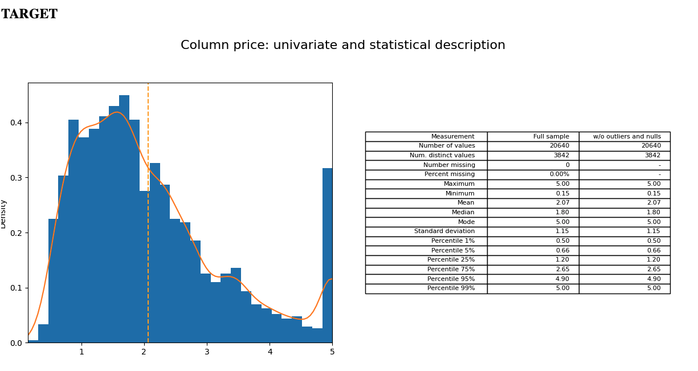
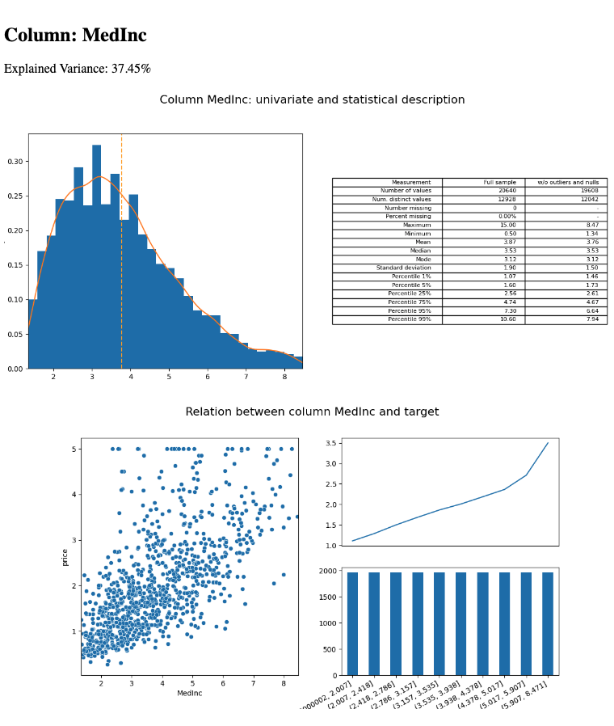

# TargetViz
This library generates HTML reports relating a target variable with all the dependent variables of a dataset.

## Installation
You can install TargetViz using pip

```bash
pip install targetviz
```


## Example
To generate an HTML report, just use the `targetviz_report` function, passing as arguments the dataset and indicating the name of the target variable.
```py
import pandas as pd
from sklearn import datasets

import targetviz

# Load an example dataset fom sklearn repository
sklearn_dataset = datasets.fetch_california_housing()
df = pd.DataFrame(sklearn_dataset.data, columns=sklearn_dataset.feature_names)
df['price'] = pd.Series(sklearn_dataset.target)

# Generate HTML report in the current directory
targetviz.targetviz_report(df, target='price', output_dir='./', name_file_out="cal_housing.html", pct_outliers=.05)
```

The function targetviz.targetviz_report outputs an html file in the working directory.


# Mini Tutorial
Let's give an example of how to use that with a real live dataset, for that let's use the california housing dataset from sklearn.
This dataset contains information on house prices in California from the 1990s along with other features.

Let's start by generating the report, for that we will use the code in the [example above](#example)

Notice we have added outlier removal. If we set it to 5%, it will remove the top 2.5% and bottom 2.5% of rows when analysing each column (e.g. rows where column income is very high or very low). This typically makes the plots nicer.

So we have the report generated [here](./samples/cal_housing.html). Let's take a look.

First we have a quick univariate analysis of the target value (median price of houses in units of 100k USD), in this case it is a regression, but it also accepts binary or categorical variables.
From the histogram we can see that the values go from 0 to 5, the spike at 5 suggest results might have been clipped. We can see the mode at ~1.5 and the mean close to 2. We probably would have expected a long tail on the right if results had not been clipped

Next to the histogram we have the table with some statistics that can help us understand the variable.




Now let's look at the first predictor, which is column MedInc (median income). Note that columns are sorted based on how much of the target they can explain, so the first variable is likely the most powerful.

We have the same univariate plot and table as for the target.

We also have 3 more plots that help us explain the relation of this variable to the target variable.
On the left we have a scatterplot so that we can get a first view. But it is sometimes difficult to get a good view of the correlation with the scatter plot, so we also have a another plot on the top right. Here we split the predictor variable MedInc into quantiles. We then plot the average of the predicted variable (house price) for each of those quantiles. It is here that we see, that on average, places with higher income tend to have way more expensive houses.


We can dig deeper and we wil see different relationships. When we arrive to house age, we see something interesting: older houses tend to be more expensive. That doesn't make economical sense, under the same conditions, a new house is typically more desirable, since they have better conditions and tend to have less issues.
The problem here is "under the same conditions", which is clearly not true in the real world. Probably older houses tend to be in city centers where the square footage is quite expensive and thus the counterintuitive results.
The reason I'm bringing this up is that we need to be careful when jumping to conclusions, and we need to think critically about the results we see

Some other important things to know:

In the file config.yaml there are some default configuration values. Those can be overriden when calling the function `targetviz_report`. For example, the default for outlier removal is 0% but in our function we set it to 5% using pct_outliers=0.05

For calculating the explained variance, we first divide the explanatory variable into quantiles, we then calculate the sum of squares between groups:


and we divide this number by the total sum of squares to get the percentage explained


## Another example
We can also compute the same report for the titanic dataset ([see result](./samples/titanic.html))]


```py
import pandas as pd
import targetviz

# Load the Titanic dataset from a CSV file directly from the web
url = "https://raw.githubusercontent.com/datasciencedojo/datasets/master/titanic.csv"
# Load an example dataset fom sklearn repository

titanic = pd.read_csv(url)

# Generate HTML report in the current directory
targetviz.targetviz_report(titanic, target='Survived', output_dir='./', name_file_out="titanic.html", pct_outliers=.05)
```
